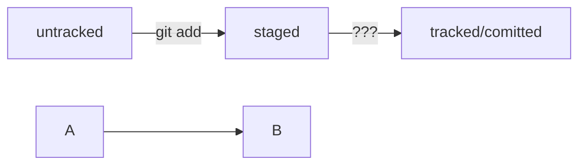

# ДЗ по Гит

### Инициализация проекта
``` git init ```

### _Проба пера_

## *Важно проверять статус файлов перед коммитом*

### _используй_

``` git status ```


```mermaid
graph LR;
  untracked -- "git add" --> staged;
  staged    -- "???"     --> tracked/comitted;

%% стрелка без текста для примера: 
  A --> B;
```
